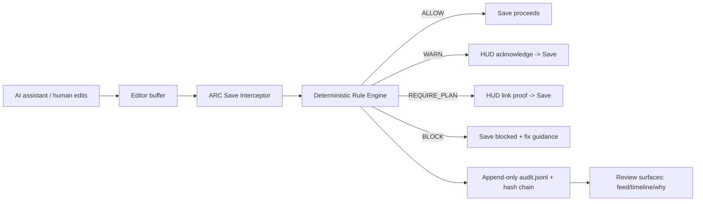
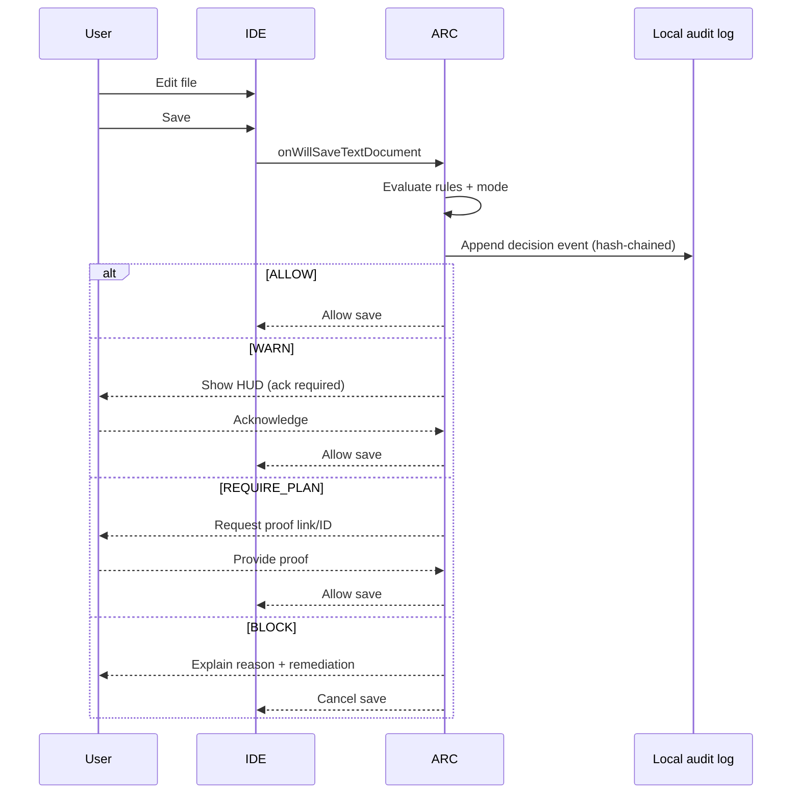

# ARC Audit-Ready Core market feasibility and Axis-ready artifact

## Executive summary

ARC (Audit-Ready Core / “ARC XT”) is positioned as a deterministic, local-first governance layer that sits **below AI coding tools and above Git/PR/CI**, evaluating changes at the **moment of save** with a 4-tier decision engine (ALLOW / WARN / REQUIRE_PLAN / BLOCK) and writing an append-only, hash-chained audit log. This core concept is already clearly articulated on the VS Marketplace listing and the ARC landing page (deterministic, tamper-evident, “before PR/CI,” save-time decisions). citeturn19view0turn17view0

The timing is favorable: developer AI usage is now mainstream. Stack Overflow’s 2025 survey reports **84%** of respondents are using or planning to use AI tools in development, and about **50.6%** of professional developers use AI tools daily. citeturn26view0 JetBrains’ large-scale survey reporting says **90%** of developers regularly used at least one AI tool at work (Jan 2026), while also noting AI use is often “ad hoc” and not systematized—exactly the gap ARC targets. citeturn25view1turn25view0

The biggest near-term constraint is not “build,” it is **retention + trust**. Your current messaging is technically strong but can read as abstract (“tamper-evident accountability”) rather than concrete (“catches risky AI-generated changes before you save/commit”). Your public assets also have a notable enterprise-trust mismatch: your corporate **Security/DPA pages reference payroll/DocSmith workflows**, which could confuse regulated buyers evaluating ARC. citeturn50view0turn49view1turn48view0

Competitively, ARC is in a newer category: “AI-era developer governance at the IDE boundary.” The crowded space is AI generation (Copilot/Cursor/Windsurf) and CI security scanning (Snyk/Semgrep/Sonar/GitHub code security). There are emerging governance-adjacent offerings such as **VS Code agent hooks**, enterprise “AI governance add-ons,” and at least one marketplace extension (Genoma) explicitly offering tamper-evident governance features. ARC’s sharpest differentiator is: **read-only governance + deterministic save-gate + privacy-first (no prompt/code telemetry)**, which is attractive for regulated teams if packaged correctly. citeturn53view0turn52view1turn52view0

A realistic solo-friendly monetization path is: keep a meaningful free tier to grow installs, then charge for “team/regulated readiness” features (signed rule packs, dispute/override workflow, policy distribution, on-prem licensing, reporting) at **$12–$45/user/month**. This fits observed willingness-to-pay for AI dev tooling: paid AI editors and assistants commonly sit around **$10–$20/mo for individuals** and **~$40/user/mo for teams**. citeturn27view0turn27view1turn28view0

## Public asset audit for messaging alignment and SEO/AI discoverability

### entity["company","Visual Studio Marketplace","microsoft extension store"] listing

What’s working:
- Clear description of the audit-layer concept, the 4-tier decision engine, local-first posture, and explicit AI→ARC→Git pipeline diagram. citeturn19view0
- You already communicate “cloud disabled by default,” “fail-closed,” and “append-only… hash-chain integrity,” which are strong enterprise cues. citeturn19view0
- The listing shows **“4 installs”**, matching your reported early traction signal. citeturn19view0

What’s misaligned / missing:
- The page mentions “Channels: Visual Studio Marketplace + Open VSX” but does **not provide the Open VSX install link** in the body. That’s a conversion leak because many AI-first editors and downstream forks rely on Open VSX. citeturn19view0turn38view0
- The first sentence (“Governed code enforcement… audit layer… tamper-evident…”) is “systems language.” For early/non-traditional devs (and for AI discoverability), you need a single, repeated, concrete phrase like:  
  **“Catches risky AI-generated code changes before you save or commit.”**  
  Today, that phrase is not the headline.
- You reference “Blueprint Proof” but do not immediately define it in plain terms (e.g., “a short plan link or ticket that explains intent”). This increases perceived complexity for new users. citeturn19view0

SEO / AI discoverability recommendations:
- Add a “Who this is for” paragraph with high-intent keywords: “Copilot,” “Cursor,” “Windsurf,” “Claude Code,” “AI-generated code,” “save-time gate,” “commit gate,” “audit log,” “regulated,” “bank,” “SOC 2,” “ISO 27001,” “NIST.” Your listing already references some AI tools; expand with the terms developers actually search. citeturn19view0turn25view1
- Add an explicit “Install” section containing two links: Marketplace and Open VSX, mirroring your public docs repo. citeturn18view0

### entity["organization","GitHub","code hosting platform"] public docs repo for ARC XT

Your public repository **arc-extension** is the strongest technical/marketing artifact right now:
- It clearly states “local-first VS Code extension,” “sits between AI coding tools and Git/PR/CI,” and enumerates the 4 decisions and config modes. citeturn18view0
- It includes both Marketplace and Open VSX links and transparently notes that the “core implementation is currently private.” citeturn18view0

Gaps to fix for trust + discoverability:
- Add a short Threat Model section: what ARC can and cannot prevent (e.g., it can prevent accidental saves of sensitive config/auth edits; it cannot guarantee semantic vulnerability absence). You partially do this in “Limitations,” but a standard threat model format improves enterprise confidence. citeturn18view0
- Add a “Telemetry contract” section explicitly stating **no code, prompts, or content are ever collected** (privacy-first). Your marketplace listing implies this (“No data leaves your machine unless…”) but it should be a single, crisp policy statement repeated across assets. citeturn18view0turn19view0
- Add a “How to evaluate ARC in 10 minutes” section that includes a guided demo workspace so people experience value immediately (reduces retention risk).

### ARC landing site

The landing page is coherent and readable:
- “Local-first • Fail-closed • Read-only,” “Below AI tools · Before PR/CI,” and the 4-tier engine are stated above the fold. citeturn17view0
- It names “Blueprint Proof” and “hash-chain integrity,” which are strong differentiators. citeturn17view0

Gaps:
- Only the Marketplace install button is prominent; **add an Open VSX install button** (or at least a “Using Cursor / Windsurf / VSCodium? Install via Open VSX”). citeturn17view0turn38view0
- The footer says “ARC XT © 2026 Lintel Core,” which may confuse buyers because the Marketplace publisher is “Star Wealth Dynamics.” Align brand naming across surfaces. citeturn17view0turn19view0

### GitHub arc-landing repo

The arc-landing repository README is essentially deployment notes (“vercel --prod”) and does not contribute to discoverability. citeturn16view0

Recommendation:
- Either archive it or turn it into a marketing README that mirrors the public docs repo and contains “AI discoverability” language (plain keywords, FAQs, install link variants).

### Star Wealth Dynamics corporate site, Security, DPA

Your corporate site provides legitimacy (location, contact) and mentions ARC as part of your portfolio. citeturn48view0

However, your **Security Overview** and **DPA summary** pages are DocSmith/payroll-oriented (“payroll processing,” “workbook data”)—that is a credibility hazard when a bank evaluates ARC specifically. citeturn50view0turn49view1

Recommendation:
- Create ARC-specific pages: `/arc/security`, `/arc/privacy`, `/arc/dpa` (even if they state “no service / no data processing; local-first; optional license checks only”). Keep DocSmith content separate.

## Competitive landscape and positioning

ARC’s real competitive set is “control layers,” not “generators.” The table below includes direct and adjacent products developers and enterprises will compare you against.

### Feature, positioning, pricing, and GTM comparison table

| Product | Category | Primary workflow position | Governance / audit capability | Pricing signals | GTM motion | ARC differentiation |
|---|---|---|---|---|---|---|
| entity["company","GitHub Copilot","ai coding assistant"] | AI assistant | In-editor suggestions + chat | Some enterprise controls; not a deterministic save-gate | Free tier and paid plans (pricing page lists a Free plan with limited requests/completions). citeturn27view0 | Bottom-up + enterprise bundling | ARC sits *under* any assistant (including Copilot) and gates save/commit with deterministic rules |
| entity["company","Cursor","ai code editor"] | AI-native editor | Editor + agents (multi-file edits) | Some team controls; focuses on generation | Individual Pro **$20/mo**, Teams **$40/user/mo**, Enterprise custom. citeturn27view1 | Bottom-up viral | ARC sells as governance “seatbelt” for AI-first workflows; stays tool-agnostic |
| entity["company","Windsurf","ai code editor"] | AI-native editor | Editor + agent workflows | Team features include dashboard/SSO/RBAC; not a deterministic, content-agnostic save-gate | Pro **$20/mo**, Teams **$40/user/mo**, Enterprise “Let’s talk,” plus Max $200/mo. citeturn28view0 | Bottom-up → enterprise | ARC can run above Windsurf via VS Code extension ecosystem, focusing on auditability rather than generation |
| entity["company","JetBrains","developer tools vendor"] AI plans | AI features in IDE | IDE-level AI assistance | Some governance exists via enterprise suite; not save-gate oriented | AI plans shown (Free/Pro/Ultimate tiers with monthly pricing). citeturn27view3 | Enterprise stronghold | ARC’s wedge is VS Code ecosystem + editor-agnostic governance; eventually expand to other IDEs |
| entity["company","Snyk","application security company"] | SAST/SCA/Secrets | CI + IDE scanning | Detects vulnerabilities; not a deterministic save-gate audit layer | Plans start “from $25/month” and include IDE scanning/fixes. citeturn27view4 | Security-led + dev-led | ARC complements scanners: it enforces “intent + boundaries” at save-time, not full semantic vulnerability detection |
| entity["company","Semgrep","static analysis company"] | SAST/SCA/Secrets | CI + PR checks + IDE | Policy-as-code style scanning; not save-gate | Teams starts **$30/month per contributor**; free up to 10 contributors. citeturn27view5 | DevSecOps teams | ARC is earlier in the loop (save), lighter weight, and privacy-first by default |
| entity["company","Sonar","code quality company"] | Code quality / SAST | CI + PR checks | Quality/security rules; not save-gate | Cloud Team starts ~€30/month for 100k LOC. citeturn27view6 | Engineering management | ARC provides deterministic “operator acknowledgment / proof” mechanics rather than large-scale static analysis |
| entity["company","GitHub Advanced Security","code security add-on"] | Code security | Repo/CI | Secret protection + code scanning; enterprise governance | Secret Protection **$19/active committer/mo**, Code Security **$30/active committer/mo**. citeturn27view7 | Enterprise platform | ARC is IDE-native and local-first; can feed evidence into repo-level programs without capturing code content |
| entity["company","Coder","remote dev platform vendor"] AI Governance Add-On | Enterprise AI governance | Workspace platform | Auditing AI activity, policy enforcement, “AI Bridge” gateway; captures prompts/usage | Sold as add-on to Premium seats (contact sales). citeturn52view1 | Enterprise top-down | ARC is simpler: no gateway requirement, runs locally, can avoid prompt/code capture entirely |
| entity["organization","Visual Studio Code","code editor"] Agent hooks | Agent lifecycle governance | Agent session events | Deterministic hooks can block commands, create audit trails, automate checks | Built into VS Code agentic customization; preview. citeturn53view0 | Platform feature | ARC is broader than agent sessions: it enforces at save-time regardless of which AI tool produced the change |
| entity["company","Continue.dev","ai dev platform"] | AI checks on PR | PR/CI boundary | “Source-controlled AI checks on every pull request” | Positioned as “quality control” checks. citeturn22search9 | Dev teams | ARC moves checks earlier (save) and produces a tamper-evident local audit trail |
| entity["company","Genoma","vs code extension"] | IDE AI + governance extension | In-editor apply flow | Policy-as-code profiles, chain-of-custody, override auditing, telemetry options | Marketplace listing emphasizes tamper-evident chain-of-custody + governance metrics. citeturn52view0 | Marketplace distribution | ARC differentiates with “not an assistant,” simpler mental model, and a strict privacy-first contract (no content telemetry) |

Key positioning inference:
- The AI editor market has normalized **$20/mo individual** and **$40/user/mo teams** pricing. That anchors willingness-to-pay for “dev workflow acceleration” and suggests room for a governance layer at **$10–$25/user/mo** if it reduces rework, risk, or compliance overhead. citeturn27view1turn28view0turn27view0
- Enterprise governance solutions (e.g., platform add-ons) often emphasize centralized auditing of prompts/tool invocations, which conflicts with your “privacy-first, no content telemetry” goal—ARC can win with regulated organizations by offering a safer default posture. citeturn52view1turn19view0
- Genoma indicates there is already demand for “tamper-evident governance” inside the editor; ARC must differentiate by clarity, simplicity, and trust (and by being assistant-agnostic). citeturn52view0turn18view0

## Market demand, buyer personas, and pricing feasibility

### Demand signals and the “why now”

- AI usage is mainstream in development: Stack Overflow reports **84%** using or planning to use AI tools, with **~50.6%** of professional developers using AI tools daily. citeturn26view0
- Developers increasingly struggle with “almost-right” code: Stack Overflow’s survey writeup highlights that **45%** cite “almost right, but not quite” as the #1 frustration, and **66%** say they spend more time fixing almost-right AI code. This is a direct value driver for save-time governance and accountability. citeturn26view1
- JetBrains reports **90%** of developers used at least one AI tool at work (Jan 2026) and explicitly notes AI use is often not systematized (“ad hoc”), which creates an opening for deterministic controls at the workflow boundary. citeturn25view1turn25view0

### Buyer personas

**Individual developer (AI-augmented)**
- Pain: losing time debugging “almost-right” AI code, accidental risky changes to config/auth, uncertainty about what was changed. citeturn26view1turn19view0
- Buying trigger: “I want a seatbelt that blocks dumb mistakes but doesn’t slow me down.”

**AI-first / non-traditional developer (vibe-coding leaning)**
- Pain: low discipline around review, deletes friction quickly; tends to uninstall guardrails on first false positive.
- Buying trigger: “Make it feel like a helpful coach, not a compliance system.”
- Product requirement: progressive modes, crisp “why,” easy override + learning loop.

**Team lead / engineering manager**
- Pain: inconsistent AI usage practices, uneven review quality, hard-to-prove accountability when incidents happen.
- Buying trigger: “We need evidence and a consistent workflow without banning AI.”

**Regulated organization (banks, government, defense contractors)**
- Pain: third-party risk, auditability, software supply chain risks, restrictive extension policies.
- Buying trigger: “Local-first + no code exfil + strong audit trail + deployable in private marketplace/on-prem.”

### Willingness-to-pay and realistic pricing tiers

Observed price anchors in the developer AI tool ecosystem:
- Individual AI tools range from free tiers to **~$20/mo** for “Pro” plans. citeturn27view0turn27view1turn28view0
- Team plans for AI editors cluster at **~$40/user/mo**. citeturn27view1turn28view0

A solo-friendly ARC pricing structure that stays within your requested $10–$50/mo band:

- **ARC Free**: RULE_ONLY mode, default rule pack, local audit log, WARN/ALLOW only (no blocking), limited “Why” explanations (enough to feel value).
- **ARC Pro ($12/user/mo)**: full save-gate including BLOCK/REQUIRE_PLAN, Blueprint Proof linking, workspace profiles (Solo / Team / Regulated), local rule tuning UI, exportable “audit summary” (no content).
- **ARC Team ($24/user/mo)**: shared rule packs (signed), policy distribution via repo config, team-level “exceptions registry” (in repo), role-based override workflow (2-person approval for high-risk overrides).
- **ARC Enterprise ($45/user/mo)**: offline licensing, on-prem distribution support docs, procurement pack (security brief, threat model), signed releases, support SLA, and compatibility guidance for private marketplaces.

These tiers map to value: individuals buy convenience+confidence; teams buy consistency; regulated buyers buy deployability + audit posture.

### Revenue scenarios

These scenarios assume you prioritize a free tier to grow installs and then convert.

| Scenario | Active users | Paid conversion | Paid users | ARPU | MRR |
|---|---:|---:|---:|---:|---:|
| Early validation | 1,000 | 2% | 20 | $12 | $240 |
| Healthy indie | 5,000 | 3% | 150 | $12 | $1,800 |
| Sustainable solo | 10,000 | 5% | 500 | $12 | $6,000 |
| Team wedge | 2,000 (teams) | 10 teams × 10 seats | 100 | $24 | $2,400 |
| Mixed | 10,000 | 4% Pro + 5 teams | 400 + 50 | $12/$24 | ~$6,000 |

Given your current lack of retention metrics (Open VSX download count vs active usage), your first monetization milestone should be: measure **3‑day retention** and “save-gate engagement” (see telemetry contract below) before committing to heavy enterprise sales motions.

## Enterprise feasibility for banks and confidential institutions

### What banks will expect and why it’s hard for a solo founder

Bank procurement is dominated by third-party risk management practices: due diligence, contractual clarity, and lifecycle controls. For the U.S., regulators and agencies publish guidance emphasizing risk-based oversight of third-party relationships across the lifecycle. citeturn23search15turn23search3 In the EU, guidance on ICT and security risk management similarly raises expectations for robust controls and oversight. citeturn23search4

As a solo founder, the feasible path is to minimize your “vendor surface area” by making ARC:
- **local-first and offline-capable**
- **deployable via internal extension channels**
- **non-dependent on your hosted infrastructure for core function**
- **auditable by the buyer**

This reduces what the bank must “trust” you to operate.

### Distribution constraints for regulated environments

You need to assume many banks will not allow developers to install from public marketplaces.

Enterprise options exist in the VS Code ecosystem:
- VS Code supports controlling allowed extensions and can block unlisted ones via organization settings/policies. citeturn55view2
- VS Code also documents a **private extension marketplace** for enterprises to self-host and distribute extensions, with features like allowlisting, rehosting, and air-gapped support; it notes availability for GitHub Enterprise customers. citeturn55view0turn55view1
- Open VSX explicitly supports being used as an extension gallery endpoint in VS Code forks via a configured `extensionsGallery` (serviceUrl/itemUrl/extensionUrlTemplate). citeturn38view0
- Running Open VSX on-prem is a documented pattern in the Eclipse ecosystem (useful for air-gapped or sovereign environments). citeturn47search4turn47search15

### Security and audit requirements ARC must meet to be “bank sellable”

Minimum “Bank-ready ARC” checklist:

**Audit trail content + integrity**
- NIST audit guidance emphasizes that audit records should establish what event occurred, when/where, source, outcome, and identity. ARC’s audit log should map cleanly to that structure without logging code content. citeturn23search6turn23search14
- Provide a deterministic, hash-chained `.arc/audit.jsonl` format (already part of your messaging). citeturn19view0turn17view0

**Explainability**
- Every WARN/REQUIRE_PLAN/BLOCK must have a short, stable, human-readable reason (“Matched rule: auth-path-changed,” “Detected .env edit,” etc.) and a “How to resolve” step.

**Override / dispute workflow**
- Banks will demand contingencies: permitted override with justification and (for strict modes) dual approval. This is also fundamental to retention for non-traditional devs.

**On-prem / offline support**
- Paid Enterprise tier should support fully offline license validation (or no licensing check at runtime if purchased via contract), and produce artifacts that can be deployed via internal marketplaces or direct VSIX installation.

**Supply chain posture**
- Extension ecosystems have had notable supply-chain vulnerabilities; the NVD entry for a 2025 Open VSX publishing-system issue describes privileged token exposure risk enabling unauthorized publishing under namespaces. citeturn47search9turn29search4  
  Practical implications for ARC enterprise readiness:
  - signed releases
  - reproducible builds (or at least published SHA256 checksums)
  - documented internal verification steps
  - optional compatibility with “rehosted” extension distribution in private marketplaces citeturn55view0

**Procurement pack**
- Provide a 5–8 page PDF/MD pack: architecture boundary, data flow, threat model, telemetry contract, deployment, and support terms. Right now your corporate Security/DPA pages reference payroll and DocSmith; you need ARC-specific versions to avoid credibility loss. citeturn50view0turn49view1

### “Complete black box + local AI shell” for banks

If ARC becomes a local “AI shell” that routes among models, you greatly expand the bank’s risk surface: model licensing, model updates, data handling, prompt logging, potential training data leakage, and support burden. Many enterprise governance offerings explicitly capture prompts/tool invocations for observability, which conflicts with your privacy-first constraints. citeturn52view1turn26view1

A more enterprise-feasible posture is:
- ARC remains **an enforcement/control layer** and integrates with existing AI tools (Copilot, Cursor, Windsurf, Claude Code) without becoming the AI runtime.
- Optional “local lane” evaluation can exist, but remains strictly local, configurable, and off by default (mirrors your current messaging). citeturn19view0turn18view0

## Product/market fit risks and mitigation plan

### Core PMF risks

**False positives → uninstall**
- The fastest way to lose early AI-first users is blocking normal work.
- Genoma’s listing explicitly highlights “profiles” like strict/balanced/experimental and dual approval—competitive signal that adaptive enforcement matters. citeturn52view0

**Onboarding complexity**
- “Blueprint proof” can sound like bureaucracy if not framed as “link a ticket/plan/checklist.”

**Performance / latency**
- Save-time gating must be fast; otherwise users disable it.

**Lack of metrics**
- You report Open VSX downloads ~392 and Marketplace installs 4, but have no active usage visibility; you need privacy-first instrumentation that captures *events* not *code*. (Your user constraint: no code/content telemetry.)

### Mitigations

**Progressive enforcement modes**
- Start default in “Coach mode” (ALLOW/WARN only) for the first 30 saves; gradually introduce REQUIRE_PLAN and BLOCK once users have seen the value and can tune rules.
- Provide a one-click “I’m learning / I’m shipping / I’m regulated” mode selector.

**First-run demo**
- Auto-open a sandbox demo file that triggers each tier once, with a clear explanation and how to proceed (acknowledge, link proof, fix issue).
- Marketplace already mentions “Show Welcome Guide”; elevate this into a structured interactive walkthrough. citeturn18view0turn19view0

**Override + dispute**
- Add: “Override with reason” (writes audit event), “Dispute this rule” (adds local candidate entry), and optionally “Require second approval” in strict modes.

**Telemetry contract (privacy-first)**
- Publish a non-negotiable contract: no source code, prompts, or file content ever leaves the machine. Only counts and event types, opt-in. This addresses developer trust issues highlighted in broader AI tooling backlash. citeturn26view1turn19view0

## Solo-friendly go-to-market plan and execution checklist

### Minimal GTM loop

Your loop should be:

Marketplace page ↔ ARC landing ↔ public GitHub docs ↔ short “How it works” video/GIF ↔ back to install

Right now, the loop breaks primarily because Open VSX is not front-and-center on the landing and Marketplace copy, and because corporate/legal pages are not ARC-specific. citeturn17view0turn19view0turn50view0

### Seed content strategy

Three fast, high-leverage posts (each should link to landing + Marketplace + Open VSX):

1) “I built a save-gate for AI-generated code” (demo video/GIF of WARN → REQUIRE_PLAN → BLOCK)  
2) “Why ‘almost-right’ AI code is costing developers time (and how to stop it at save-time)” (tie to Stack Overflow stats) citeturn26view1turn26view0  
3) “Local-first audit trails for regulated dev teams (no code telemetry)” (tie to enterprise extension controls + private marketplace) citeturn55view0turn55view2  

### Solo-friendly early sales outreach

Target **compliance-heavy smaller buyers first** (fintech startups, healthcare SaaS, B2B platforms) before tier‑1 banks. Bank procurement is doable but slow due to third‑party risk management requirements. citeturn23search15turn23search3

### 30-day execution checklist

- Rewrite Marketplace headline + first 10 lines to the canonical phrase: “Catches risky AI-generated code changes before save/commit.” (Keep the deeper “tamper-evident” language below.) citeturn19view0
- Add Open VSX install link prominently on landing and Marketplace.
- Publish “Telemetry contract” section in GitHub docs repo.
- Implement first-run demo + progressive modes (coach → strict).
- Add override-with-reason and “dispute rule” capture (local file).
- Add minimal privacy-safe telemetry (opt-in) and local metrics dashboard.

### 90-day execution checklist

- Release signed rule packs + “starter policies” for common stacks (Node, Python, Java, Terraform, SQL migrations).
- Team tier: shared rule pack distribution via repo + dual approval for overrides.
- Enterprise “procurement pack” and ARC-specific security/privacy pages (separate from DocSmith/payroll). citeturn50view0turn49view1
- Run 10–20 short user interviews focused on false positives and uninstall friction.
- Convert 2–5 teams to paid Team tier via direct outreach.

## Axis-ready artifact

### Executive product spec

ARC is a deterministic IDE-integrated control layer that evaluates code changes at save-time and optionally at commit-time, classifies risk into ALLOW/WARN/REQUIRE_PLAN/BLOCK, and records a tamper-evident audit trail. It does not generate code; it governs changes produced by humans or AI tools. citeturn18view0turn17view0turn19view0

#### Architecture sketch



#### User flow



### Telemetry contract

Constraints: **privacy-first; no code/content telemetry** (no file contents, no prompts, no diffs, no embeddings). Only event metadata and counters, opt-in.

Recommended event schema (JSON lines, local-first; remote upload unspecified/optional):

```json
{
  "event_id": "uuid",
  "ts": "2026-04-03T12:34:56.789Z",
  "arc_version": "0.1.x",
  "ide": "vscode",
  "workspace_hash": "sha256(workspacePathSalted)",
  "event_name": "save_decision",
  "properties": {
    "mode": "RULE_ONLY",
    "decision": "WARN",
    "rule_id": "config-env-edit",
    "file_class": "env_like",
    "latency_ms": 18,
    "hud_shown": true,
    "user_action": "acknowledged"
  }
}
```

Core event types:
- `install`, `activate`, `config_loaded`, `mode_changed`
- `save_intercepted`, `save_decision`
- `hud_opened`, `acknowledged`, `proof_linked`, `override_used`, `save_blocked`
- `audit_verified`, `audit_corruption_detected` (if you provide verification)
- `rule_disputed` (user flags false positive)

Minimal SQL examples (if events are mirrored into a local SQLite DB, backend unspecified):

```sql
-- 3-day retention proxy: distinct workspace_hash active on day 0 and day 3
SELECT
  day0.cohort_day,
  COUNT(DISTINCT day0.workspace_hash) AS day0_users,
  COUNT(DISTINCT day3.workspace_hash) AS day3_users
FROM (
  SELECT workspace_hash, date(ts) AS cohort_day
  FROM events
  WHERE event_name = 'save_decision'
) day0
LEFT JOIN (
  SELECT workspace_hash, date(ts) AS active_day
  FROM events
  WHERE event_name = 'save_decision'
) day3
ON day0.workspace_hash = day3.workspace_hash
AND day3.active_day = date(day0.cohort_day, '+3 day')
GROUP BY day0.cohort_day;
```

### Failure modes and mitigations

- **False positive blocks** → progressive modes + override-with-reason + rule dispute capture.
- **False negatives** → communicate scope clearly (“governance layer, not full semantic scanner”). citeturn19view0turn18view0
- **Latency spikes** → hard timeouts; degrade to WARN instead of BLOCK when evaluation budget exceeded (configurable for regulated mode).
- **Audit log tampering** → hash chain verification + “audit integrity status” in UI (landing already references hash-chain integrity). citeturn17view0turn19view0
- **Enterprise distrust due to unclear legal/security posture** → ARC-specific security/privacy pages; stop reusing DocSmith payroll language. citeturn50view0turn49view1

### Metrics to prove

Primary:
- **3‑day retention**: % of workspaces with `save_decision` on day 0 that also have `save_decision` on day 3.
- **Active users**: daily distinct `workspace_hash` with at least one `save_decision`.
- **Save gate engagement**: `% saves with WARN/REQUIRE_PLAN/BLOCK`.
- **False positive proxy**: high override rate or high dispute rate per rule.

Secondary:
- **Latency**: p50/p95 evaluation latency.
- **Rule utility**: which rules trigger and what users do afterward (ack/proof/override).

### Recommended packaging and pricing

- Free: allow viral adoption and reduce friction.
- Pro ($12): full save-gate, proof linking, better “Why,” profiles.
- Team ($24): signed shared policy packs + dual approval.
- Enterprise ($45): on-prem-friendly license + procurement pack + support.

This is aligned with the broader price expectations in AI dev tooling (Pro ~$20/mo, Teams ~$40/user/mo in AI editors; repo security add-ons can be far higher). citeturn27view1turn28view0turn27view7

## Sample copy artifacts

### Marketplace / README headline rewrite

**ARC: Catch risky AI-generated code before you save or commit.**

ARC is a local-first governance layer for AI-assisted development. It does not generate code. It evaluates changes at save-time, explains *why* a change is risky, and (in strict modes) blocks unsafe saves until you acknowledge risk or link a plan/proof.

- Works with Copilot, Cursor, Windsurf, Claude Code, and any editor workflow that lands in VS Code.
- Local-first by default; optional lanes can be enabled explicitly.
- Tamper-evident audit log (`.arc/audit.jsonl`) with hash-chain integrity.

**Install**
- Marketplace (VS Code): …  
- Open VSX (Cursor / Windsurf / VSCodium / Theia): …

(Use your existing links; the key change is the first sentence and the explicit Open VSX path.) citeturn18view0turn19view0

### Three ready-to-post social threads

**Thread 1: “Save-gate for AI code”**
1/ I built a VS Code extension that acts like a *seatbelt for AI code*.  
It evaluates changes **before save**, not after PR.  
2/ The problem: AI code is often “almost right,” and teams spend time fixing it later. That delay is expensive. citeturn26view1  
3/ ARC classifies each save into: ALLOW / WARN / REQUIRE_PLAN / BLOCK.  
4/ It’s local-first and it’s not a coding assistant. It doesn’t generate code—only governs changes. citeturn19view0turn18view0  
5/ If you’re using Copilot/Cursor/Windsurf and want guardrails without sending code anywhere, try it: (links)

**Thread 2: “Why audit trails belong inside the IDE”**
1/ Most governance happens too late: PR review, CI checks, production incidents.  
2/ But AI changed the workflow: code is produced faster than humans review. ARC moves accountability to the moment of change. citeturn19view0  
3/ Every risky save becomes a recorded decision (append-only + hash chain). It’s tamper-evident by design. citeturn17view0  
4/ For regulated teams, this is the missing layer between “AI wrote it” and “we shipped it.”  
5/ If you want to test: install + run the demo flow (links).

**Thread 3: “Privacy-first governance”**
1/ Enterprise AI governance often means logging prompts and tool calls. That’s a non-starter for many regulated orgs. citeturn52view1  
2/ ARC takes the opposite stance: **no prompts, no source code telemetry**.  
3/ It only records deterministic event metadata + decisions locally, and you can export summaries without code content.  
4/ This also matches how enterprises manage extensions: allowlists, private marketplaces, rehosting. citeturn55view0turn55view2  
5/ If you want a governance layer that sits above whichever AI tool you use, ARC is built for that. (links)

## One-page Axis artifact

```markdown
# ARC Axis Artifact

## Product intent
ARC is a deterministic, IDE-integrated governance layer that evaluates code changes at save-time (and optionally commit-time) and gates risky changes before they reach PR/CI.

## Boundaries
- ARC is NOT a coding assistant (no code generation).
- ARC does NOT claim semantic vulnerability detection equivalence to SAST tools.
- ARC does NOT collect or transmit source code, diffs, prompts, or embeddings (privacy-first constraint).

## Core behaviors
- Intercepts save events.
- Classifies changes: ALLOW / WARN / REQUIRE_PLAN / BLOCK.
- Presents a HUD explaining the decision and required operator action.
- Writes append-only audit events to `.arc/audit.jsonl` with hash-chained integrity.

## Acceptance criteria
- <50ms p95 decision latency in RULE_ONLY mode on typical projects.
- Clear “Why” explanation for every WARN/REQUIRE_PLAN/BLOCK.
- Override workflow available with required justification, recorded in audit log.
- Zero content telemetry by default; explicit opt-in required for event counters.

## Key risks
- False positives cause uninstall → mitigate via progressive modes + dispute/override.
- Ambiguous positioning vs scanners → mitigate via explicit scope + “not SAST” messaging.
- Enterprise trust gap due to mismatched security/legal docs → mitigate via ARC-specific security/privacy pages and procurement pack.

## Success metrics
- 3-day retention (workspace activity) ≥ 25% in early cohorts.
- Save gate engagement: ≥ 15% of saves show WARN/REQUIRE_PLAN in active cohorts.
- Override rate < 20% of gated events after rule tuning (proxy for false positives).
```

